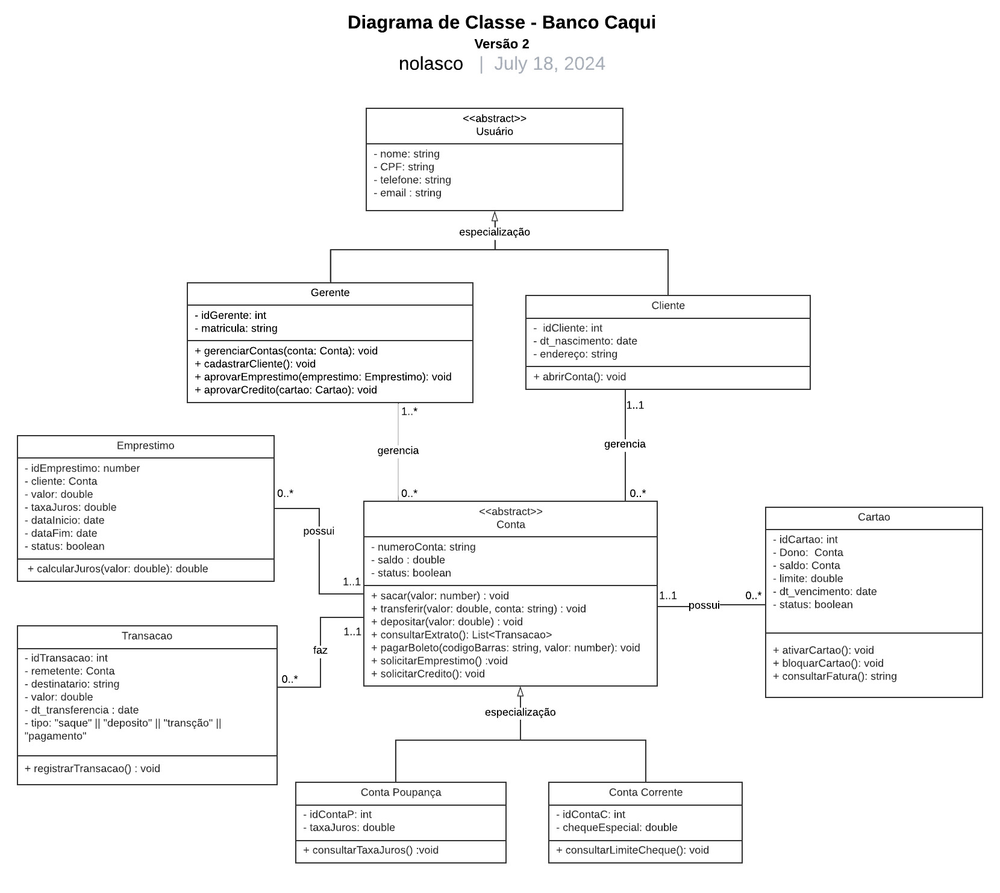

# Banco Caqui 🏛️
O Banco Caqui é um banco comunitário localizado em Mogi das Cruzes, uma cidade do interior de São Paulo conhecida como a "terra do caqui". Nosso objetivo é promover o desenvolvimento da economia local, especialmente em territórios de baixa renda de Mogi das Cruzes, por meio do apoio à economia popular e solidária.

## 🎯 Objetivo
O Banco Caqui foi criado para:

- Fortalecer a economia local de comunidades de Mogi das Cruzes.
- Apoiar iniciativas de economia popular e solidária.
- Promover o desenvolvimento sustentável em comunidades de baixa renda.

## 💳 Nossos Serviços

O Banco Caqui fornece serviços como:

- Abertura e extrato de conta corrente ou poupança.
- Operações como depósitos, saques, pagamento de contas, recebimento de aposentadorias e outros valores governamentais.
- Crédito para financiamento de empreendimentos solidários para a comunidade.
- Cartão de crédito popular solidário, para consumo familiar/pessoal, sem juros e com limite.
- Gerentes de contas do banco comunitário para suporte aos clientes.
- Prestação de contas diário e semanal do banco para toda a comunidade.

## 📌 Diagrama de Classe


## Intalação

```bash
$ npm install
```

## Inicializando o app

```bash
# development
$ npm run start

# watch mode
$ npm run start:dev

# production mode
$ npm run start:prod
```

## Test

```bash
# unit tests
$ npm run test

# e2e tests
$ npm run test:e2e

# test coverage
$ npm run test:cov
```


## Licença

Nest is [MIT licensed](LICENSE).
